# NavitonX Real Estate Platform

NavitonX is a modern, dark-themed real estate platform built on Laravel. It provides a complete property listing and blogging solution suitable for agencies, agents, and end-users.

This README covers:

- Features & functionality
- Tech stack
- Installation & setup
- How to run the project
- Admin, Agent, and User flows
- Notes about images in the `images/` folder

---

## 1. Features

### 1.1 Frontend (Public Site)
- **Home Hero Slider**
  - Large, dark-themed hero carousel with bold titles and lime accent on the last word.
  - Auto-sliding with indicators.

- **Start Your Home Search Section**
  - Dark search hero using the NavitonX theme colors.
  - Search by keyword, city, type, and purpose (rent/sale).

- **Property Listings**
  - Paginated grid of properties with:
    - Featured image background
    - City, address, type, and purpose (For Rent / For Sale)
    - Price (supports very large values due to `DECIMAL(20,2)` DB column)
    - Bedrooms, bathrooms, area, comment count
    - Rating stars based on user ratings
  - City-based filtering and dedicated city pages.

- **Property Details Page**
  - Large header image, details, features, and floor plan.
  - Contact form to message the listing agent.
  - Ratings and comments section for user feedback.

- **Agents Listing & Agent Detail**
  - List of registered agents with profile information.
  - Agent detail page with properties assigned to that agent.

- **Gallery**
  - Album/gallery management from admin side, displayed as a gallery on the frontend.

- **Blog**
  - Blog index with cards matching the dark NavitonX theme.
  - Single blog post page with white text on dark background, white bordered content card.
  - Categories, tags, and author-based filtering.
  - Comment system for blog posts.

- **Services Section**
  - Full-width, extruded dark services section with cards.
  - Each service shows an icon, title, and description, styled in MintyLime/NavitonX colors.

- **Testimonials**
  - Carousel of testimonials, themed with the MintyLime color palette.

- **Contact Page**
  - Contact form with AJAX submission.
  - Sidebar contact details (phone, email, address) with sensible defaults:
    - Phone: `+254743573360`
    - Email: `devwachirasoftware@gmail.com`
    - Address: `City Center, Nairobi, Kenya`

- **Footer**
  - Dark footer with updated text (can be customized in settings).


### 1.2 Backend (Admin Panel)
- **Admin Dashboard**
  - Overview of properties, posts, comments, and users.
  - Recent properties and posts list.

- **Property Management**
  - Create, edit, delete properties.
  - Upload featured image and floor plan.
  - Gallery images per property.
  - Validation supports large prices and image mimes (`jpeg,jpg,png`).

- **Features Management**
  - Define property features (e.g., parking, pool, etc.).

- **Services Management**
  - Create and manage services displayed on the home page.

- **Testimonials Management**
  - Create and manage testimonials for the frontend carousel.

- **Blog Management**
  - Categories and tags management.
  - Create/edit/delete posts with category and tag multiselect.

- **Gallery Management**
  - Albums and gallery images.

- **Messages**
  - View and manage messages from contact forms and property inquiries.
  - Read/unread toggling and replies.

- **Settings**
  - Site-wide settings (name, email, phone, address, footer text, social links, about us text).
  - Admin profile management (name, username, email, profile image, about text).
  - Change password.


### 1.3 Agent Panel
- **Dashboard**
  - View own properties and messages.
  - Statistics for total properties and total messages.

- **Profile Management**
  - Update name, username, email, profile photo, and about text.
  - Profile photo is stored under `storage/app/public/users` and displayed in the sidebar.

- **Property Management**
  - Create, edit, delete own properties.
  - Upload featured images and gallery images.

- **Messages**
  - View and reply to messages from users interested in their properties.

- **Change Password**
  - Update account password.


### 1.4 User Panel
- **Dashboard**
  - View comments made by the user and related content.

- **Profile Management**
  - Update name, username, email, profile image, about text.

- **Messages**
  - View and manage communication with agents.

- **Change Password**
  - Update account password.


### 1.5 Theming & Branding
- **Dark MintyLime / NavitonX Theme**
  - Global dark background with lime green and teal accents.
  - Scoped SCSS/CSS variables for consistent colors across frontend and backend.

- **Brand Name**
  - Global app name: `NavitonX properties`.
  - Frontend navbar logo text: `NavitonX` (unless overridden by settings).


---

## 2. Tech Stack

- **Backend Framework:** Laravel (classic Laravel 5.x structure)
- **Frontend:**
  - Materialize CSS (frontend)
  - AdminBSB (Bootstrap-based admin template)
- **Database:** MySQL
- **Image Handling:** `intervention/image` via `Image` facade
- **Notifications / Toastr:** Toastr for frontend/backend notifications

php7.4 artisan serve --host=127.0.0.1 --port=8000

---

## 3. Requirements

- PHP 7.2+ (Laravel 5.x is typically compatible up to PHP 7.4)
- MySQL or MariaDB
- Composer
- Node.js & npm/yarn (for asset building, if you choose to recompile assets)

> **Note:** This project originally targets an older Laravel version. On very new PHP versions you may see deprecation warnings or compatibility issues.


---

## 4. Installation & Setup

### 4.1 Clone the Repository

```bash
git clone <your-repo-url> NavitonX
cd NavitonX
```

### 4.2 Install PHP Dependencies

```bash
composer install
```

If you encounter PHP version issues, ensure you are using a PHP version compatible with Laravel 5.x (e.g., 7.4) when running Composer and Artisan commands.

### 4.3 Copy and Configure `.env`

```bash
cp .env.example .env
```

Update the `.env` file with your own settings, including:

```env
APP_NAME="NavitonX properties"
APP_ENV=local
APP_KEY=base64:...          # Generate this
APP_DEBUG=true
APP_URL=http://localhost

DB_CONNECTION=mysql
DB_HOST=127.0.0.1
DB_PORT=3306
DB_DATABASE=realestatelrvl
DB_USERNAME=realestate_user
DB_PASSWORD=********
```

Generate the application key:

```bash
php artisan key:generate
```

### 4.4 Database Setup

1. Create the database and user in MySQL (example):

   ```sql
   CREATE DATABASE realestatelrvl;
   CREATE USER 'realestate_user'@'localhost' IDENTIFIED BY 'your_password_here';
   GRANT ALL PRIVILEGES ON realestatelrvl.* TO 'realestate_user'@'localhost';
   FLUSH PRIVILEGES;
   ```

2. Run migrations (if Artisan and your PHP version are compatible):

   ```bash
   php artisan migrate
   ```

   > In this project, the `properties.price` column has been manually adjusted to `DECIMAL(20,2)` to support large prices.

### 4.5 Storage Symlink

Create the storage symlink so profile photos, property images, etc. are accessible from the web:

```bash
php artisan storage:link
```

This will expose `storage/app/public` as `public/storage`.

### 4.6 Install Frontend Dependencies (Optional)

If you need to recompile assets:

```bash
npm install
npm run dev
# or
npm run prod
```


---

## 5. Running the Application

### 5.1 Local Development Server

Start the Laravel development server:

```bash
php artisan serve
```

Visit:

- Frontend: `http://localhost:8000`
- Admin panel: `http://localhost:8000/admin/login` (or `http://localhost:8000/login` then go to admin routes depending on your auth setup)


---

## 6. User Roles & Access

### 6.1 Admin
- Typically has role `id = 1` in the `users` table.
- Access to all admin routes under `/admin/*`.
- Can manage settings, properties, services, testimonials, blog, gallery, and messages.
- Profile photo is displayed in the top-right navbar in the backend.

### 6.2 Agent
- Typically has role `id = 2`.
- Access to agent routes under `/agent/*`.
- Can manage their own properties and respond to messages.
- Sidebar shows their profile image and basic info.

### 6.3 User
- Typically has role `id = 3`.
- Access to user routes under `/user/*`.
- Can comment, manage profile, and interact with agents via messages.

> Initial users/roles may come from seeders or manual database setup depending on how you configure the project.


---

## 7. Images Folder (`images/`)

The `/images` folder in the project root contains image assets that can be used for documentation, marketing pages, or as static content.

All images currently in the folder (clickable links in GitHub / Markdown viewers):

- [`images/1.png`](images/1.png)
- [`images/2.png`](images/2.png)
- [`images/3.png`](images/3.png)
- [`images/4.png`](images/4.png)
- [`images/5.png`](images/5.png)
- [`images/6.png`](images/6.png)
- [`images/7.png`](images/7.png)
- [`images/8.png`](images/8.png)
- [`images/9.png`](images/9.png)
- [`images/10.png`](images/10.png)
- [`images/12.png`](images/12.png)

You can reference these images from Markdown or Blade views as needed.

### 7.1 Image previews (GitHub-friendly)

The images below will render directly in the README on GitHub:

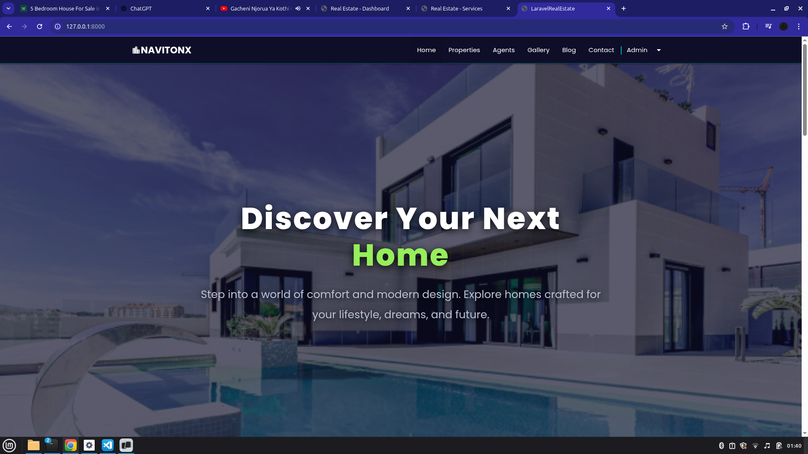
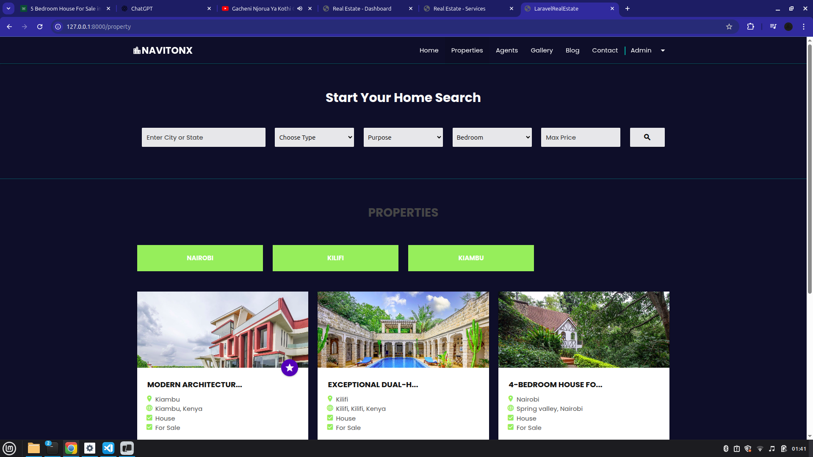
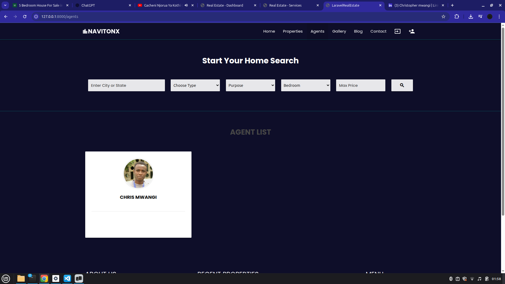
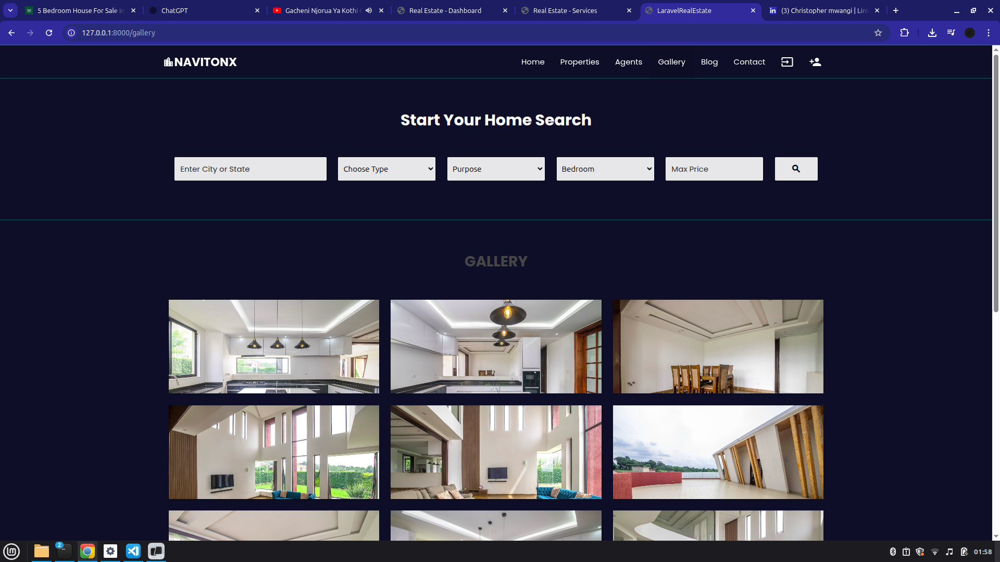
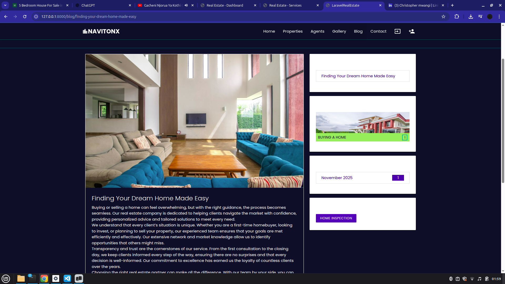
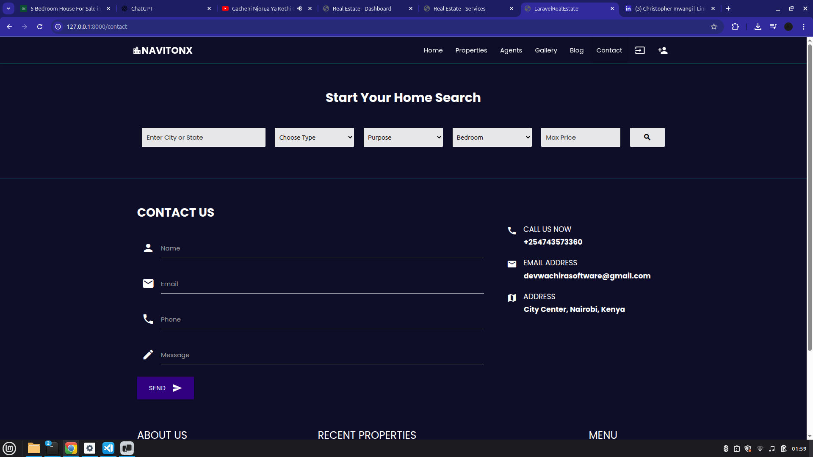
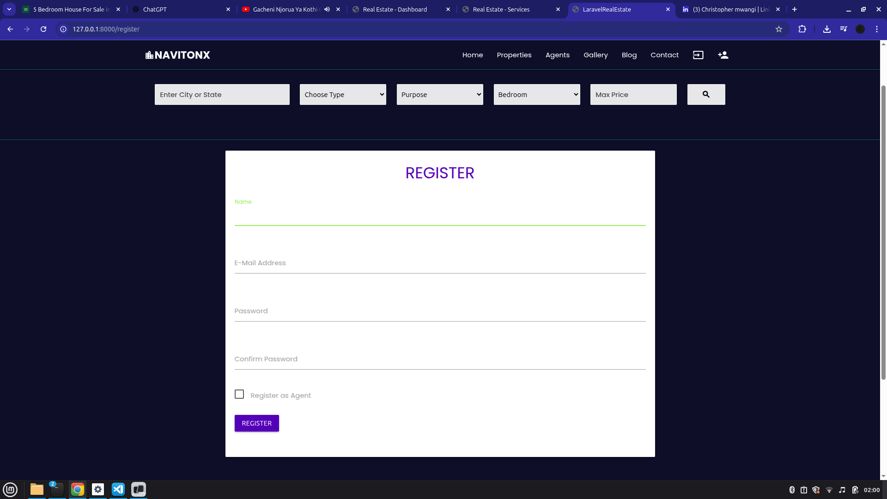
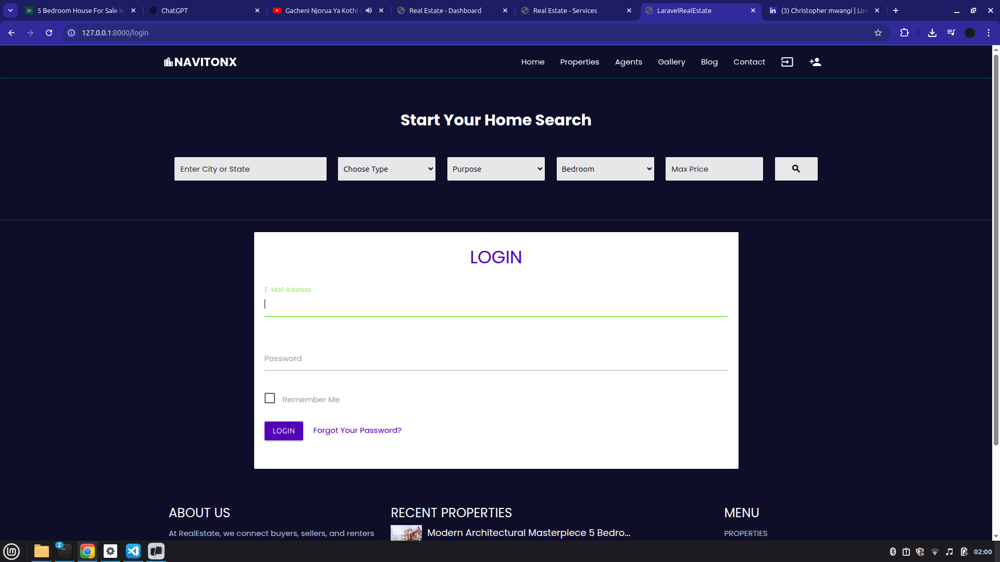
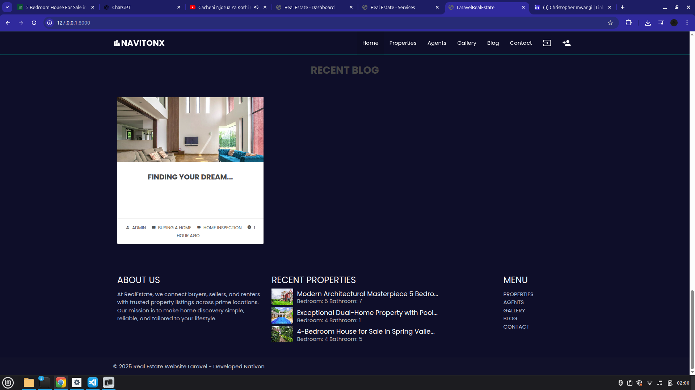
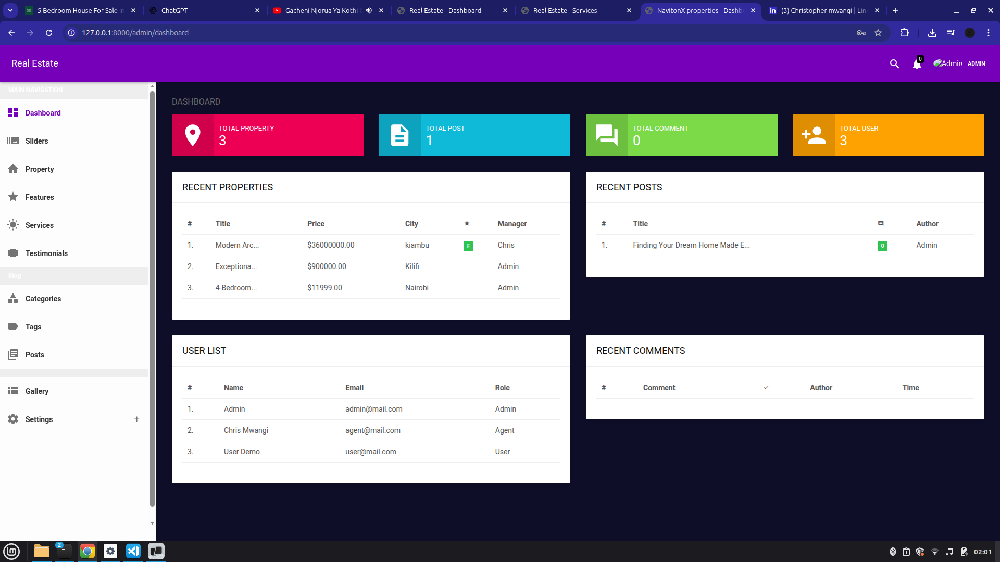
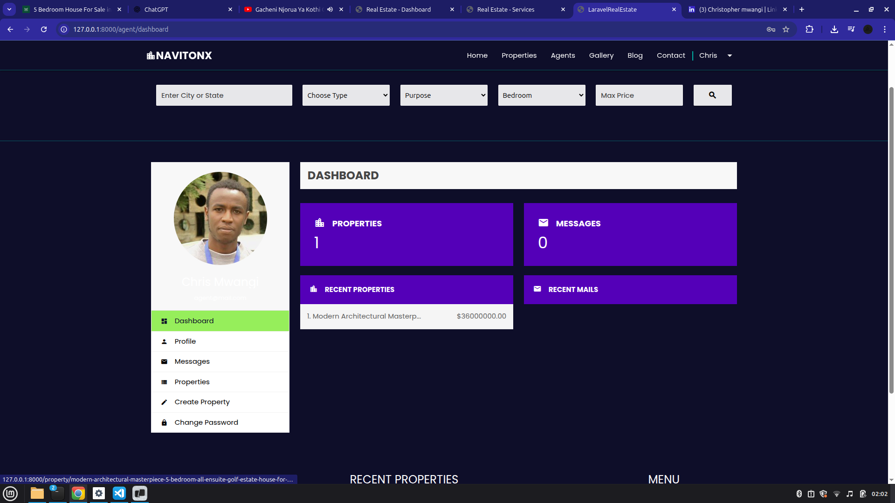

Or from a Blade template (if moved/served appropriately):

```php

```

> Note: Ensure your web server or Laravel is configured to serve files from the `images/` directory if you plan to use them directly in the app.


---

## 8. Common Issues & Notes

- **Image Validation Errors (Profile & Properties):**
  - Image validation rules have been relaxed from `image|mimes:jpeg,jpg,png` to `mimes:jpeg,jpg,png` in some places due to environment-specific issues.

- **Price Out Of Range Errors:**
  - The `properties.price` field was changed from `DOUBLE(8,2)` to `DECIMAL(20,2)` to support very large prices.

- **PHP Version Compatibility:**
  - If Artisan or Composer fail due to PHP version, try using PHP 7.4 (or a version known to be compatible with the Laravel version used here).


---

## 9. Customization

- **Branding:**
  - Update `APP_NAME` in `.env` and `config/app.php` to change the global app name.
  - Frontend navbar brand text is controlled in `resources/views/frontend/partials/navbar.blade.php` and by navbar settings from the admin panel.

- **Theme Colors:**
  - Frontend theme SCSS/CSS: `resources/assets/sass/_variables.scss`, `resources/assets/sass/app.scss`, and `public/frontend/css/styles.css`.
  - Backend theme CSS: `public/backend/css/main.css`, `public/backend/css/themes/theme-deep-purple.css`.

- **Contact Defaults:**
  - The contact page uses DB settings if present, otherwise falls back to the defaults mentioned above.


---

## 10. License & Credits

- Original Laravel real estate template from CodeAstro / Parvez Alam.
- Custom dark MintyLime / NavitonX theming and configuration applied on top of the base template.

You may adapt this project for your own real estate platform or portfolio use, subject to the original template license.
